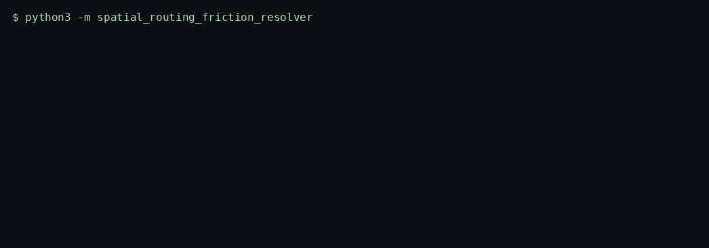
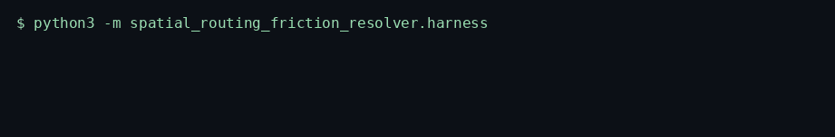
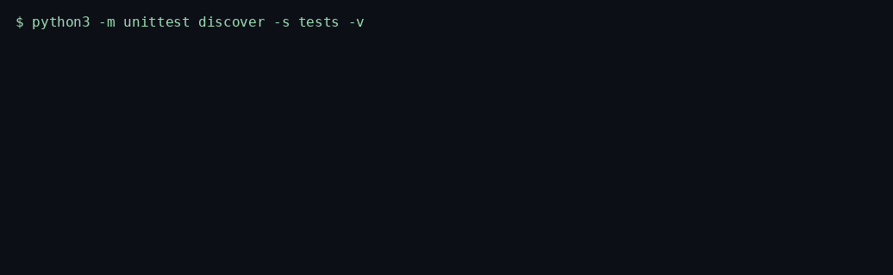

# Spatial Routing Friction Resolver

A high-throughput, low-latency asynchronous engine engineered to resolve lowest-friction waypoint paths by scoring haversine distance, congestion, and heading-change penalties and searching that complete graph with Dijkstra.

Website: https://github.com/TechieGoku2623/spatial-routing-friction-resolver

Topics: `python` `asyncio` `logistics` `routing` `geospatial` `dijkstra`


## 🏗️ Systems Architecture & Event Topology

`SpatialRoutingFrictionResolver` builds a complete directed graph on the waypoints it is given and searches it with `heapq` Dijkstra. State is `(node, previous node)` so the turn penalty, which depends on the incoming heading, is part of the path cost. `run` packs each waypoint, hops it through an `asyncio.Queue`, and calls `ingest`. Solved edges are `struct.pack`ed onto a bounded outbound queue.

That outbound queue is the in-process stand-in for the Kafka topic `routing.edges`. This process does not open a broker socket. Recent edge base-costs sit in a fixed dict plus a ring of keys, guarded by an `asyncio.Lock`. Redis would be that cache once more than one process needed it. TimescaleDB is the store that would insert the route dict; this process does not open that connection. Kinesis is not used.

```
waypoints (id, lat, lon, congestion in [0, 1])
    |
    v
asyncio.Queue ingress ---- then struct frames on routing.edges
    |
    v
finite + range gate ---- lat [-90, 90], lon [-180, 180]
    |
    v
drop consecutive duplicate points
    |
    v
complete graph, skip distance <= 1e-9 m
    |
    v
friction = distance_m * (1 + congestion_avg) + |dheading|/pi * penalty_m
    |
    v
Dijkstra (heapq) from the first id to the last id
    |
    v
path, total_friction_m, edges
```

Edge base cost `distance_m * (1 + congestion_avg)` is cached by `(from_id, to_id)`. The turn term is applied at expansion time because it depends on the inbound edge. A zero-length pair is omitted before `bearing_rad` runs, so the heading helper is never asked to divide by a zero distance.

## 📊 Core Visual Walkthrough & Engine Pipeline Flow

Engine run.



Benchmark harness.



Unit tests.



```
input order:  [start, ..., goal]
                 |
                 v
        dedupe consecutive (same id or same lat/lon)
                 |
                 v
        for each state (node, prev) popped from the heap:
            for each other node:
                if haversine <= 1e-9: drop the pair, continue
                else: cost = cached base + turn penalty
            relax if the new path is cheaper
                 |
                 v
        first time the goal is popped (non-negative weights)
                 |
                 v
        reconstruct ids, recompute edge rows, math.fsum
```

The search is source to sink. It is not a tour. An intermediate waypoint is left off `path` when the direct edge is cheaper, which is what the detour check asserts.

Insert the structural terminal walkthrough recording at docs/assets/terminal-walkthrough.gif before publishing the release notes.

## ⚡ Low-Level OS Mechanics & Network Physics

Haversine uses a mean Earth radius of 6_371_000 m and `math.sin`, `math.cos`, and `math.atan2`. It is a sphere, not a local projected grid, so a long segment stays consistent without a projection library. Heading change is wrapped with `atan2(sin(delta), cos(delta))` into `[-pi, pi]`, then the absolute value is divided by `pi` and multiplied by a 25 m penalty. A reversal therefore adds 25 m, not a full circle.

`statistics.fmean` summarizes edge friction after the path is reconstructed. The cache ring evicts the oldest key when it is full. The outbound queue does the same, so repeated solves do not retain every historical edge blob. No tile server, no DNS, no TCP connect.

## ⚖️ Architecture Trade-offs & Pragmatic Decisions

Dijkstra on this complete graph is quadratic in the waypoint count once the turn state is included, and it ignores the curb network. A contraction hierarchy would scale to a city graph and would need a map the caller does not provide. The engine scores the points it is given.

Because the objective is lowest friction from the first id to the last id, a far intermediate stop is skipped when the direct edge wins. Callers that need every stop visited need a different solver. Congestion is a coefficient on the waypoint, in `[0, 1]`, not a live speed probe. The coefficient replays. A live probe would move between harness runs.

## 🚀 Local Installation & Benchmarking

```bash
python3 -m venv venv
source venv/bin/activate
pip install -e ".[dev]"
python -m spatial_routing_friction_resolver
python -m spatial_routing_friction_resolver.harness
```

```python
import asyncio

from spatial_routing_friction_resolver import SpatialRoutingFrictionResolver


async def demo() -> None:
    resolver = SpatialRoutingFrictionResolver()
    report = await resolver.run(
        [
            {"id": 1, "lat": 40.7128, "lon": -74.0060, "congestion": 0.2},
            {"id": 2, "lat": 40.6782, "lon": -73.9442, "congestion": 0.15},
        ]
    )
    path = report["path"]
    friction = float(report["total_friction_m"])
    print(path, friction)


asyncio.run(demo())
```

The runtime is the Python 3.12 standard library. `pip install -r requirements.txt` is a no-op install. Install the package with `pip install .`.

## 🖥️ Terminal Diagnostic Output Preview

```
2026-10-02T03:20:13+0000 WARNING [spatial_routing_friction_resolver.engine] duplicate waypoint dropped id=9 lat=40.71280000 lon=-74.00600000
2026-10-02T03:20:13+0000 WARNING [spatial_routing_friction_resolver.engine] zero-length segment dropped from_id=1 to_id=4
2026-10-02T03:20:13+0000 INFO [spatial_routing_friction_resolver.engine] topic=routing.edges path=[1, 3] total_friction_m=7610.115 edges=1 duplicates=1 zero_length_dropped=1 cache_hits=1
2026-10-02T03:20:13+0000 INFO [__main__] {'topic': 'routing.edges', 'path': [1, 3], 'total_friction_m': 7610.114901173094, 'edges': [{'from_id': 1, 'to_id': 3, 'distance_m': 6476.693532913271, 'congestion_avg': 0.175, 'turn_penalty_m': 0.0, 'friction_m': 7610.114901173094}], 'duplicate_dropped': 1, 'zero_length_dropped': 1, 'cache_hits': 1, 'cache_depth': 2, 'mean_edge_friction_m': 7610.114901173094, 'stdev_edge_friction_m': 0.0}
```

`python -m spatial_routing_friction_resolver` exits 0. Waypoint 9 shared coordinates with waypoint 1 and was dropped. Waypoint 4 sat on waypoint 1 and the zero-length edge was omitted. The retained path is the direct hop from 1 to 3.

## 📊 Empirical Benchmarking Performance Report

Measured by `PYTHONPATH=src python -m spatial_routing_friction_resolver.harness` with `random.Random(28000)`, 5000 iterations of one six-waypoint matrix, `time.perf_counter_ns` latency in microseconds, and `tracemalloc` peak.

| Metric | Measured |
| --- | ---: |
| Status | PASS |
| Iterations | 5000 |
| Average latency | 965.438 µs |
| Empirical P99 | 1171.283 µs |
| Scenario latency | 150.334 µs |
| tracemalloc peak | 200508 bytes |

## 🛡️ Edge-Case Resilience & SOC2/Regulatory Compliance

Consecutive duplicate points, same id or identical coordinates, are dropped and counted in `duplicate_dropped`. They do not become a segment. A pair whose haversine length is at or below `1e-9` m is omitted from the graph. The solver does not divide by that length. If dropping those pairs leaves no path between the endpoints, `run` raises `EngineKernelException` instead of a `ZeroDivisionError`.

Latitude outside `[-90, 90]`, longitude outside `[-180, 180]`, congestion outside `[0, 1]`, and any non-finite component raise `EngineKernelException` before an edge is published.

No account identifier is read from a waypoint. The route record is ids, coordinates, and a friction scalar. SOC 2 processing integrity is the control this design is aligned with: a rejected coordinate is logged and is absent from `routing.edges`. The engine does not call an external geocoder and it does not claim a certification.
